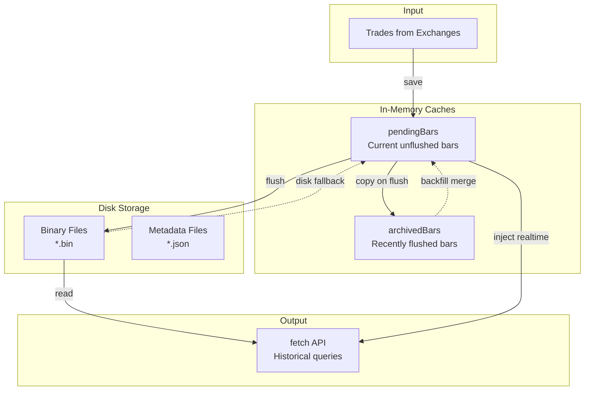
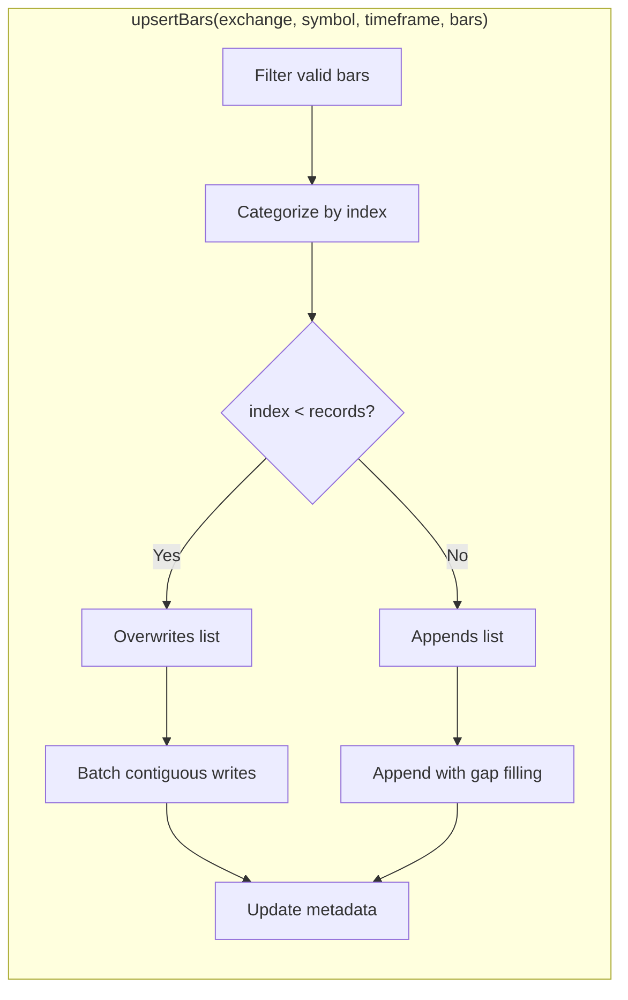
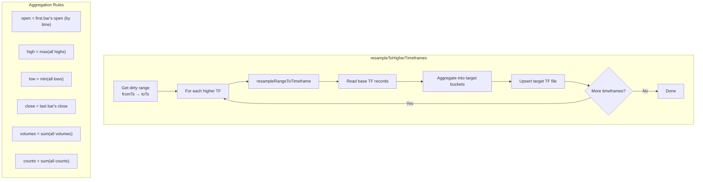
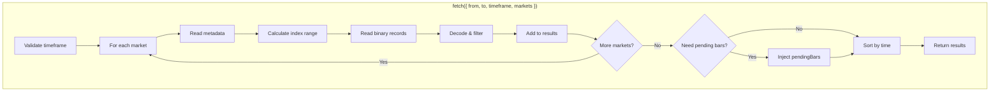

# Binaries Storage

A high-performance binary storage engine for OHLCV (Open, High, Low, Close, Volume) trade data. Designed as a drop-in replacement for InfluxDB storage with significant performance and simplicity benefits.

## Overview

Binaries Storage persists aggregated trade data in dense binary files with fixed-size records. Each market (e.g., `COINBASE:BTC-USD`) has separate files for each timeframe (e.g., `10s.bin`, `1m.bin`, `1h.bin`).

### Key Features

- **Dense indexing**: Records are stored contiguously with null bars filling gaps
- **Upsert semantics**: Can overwrite existing records or append new ones
- **Automatic resampling**: Base timeframe data is aggregated to higher timeframes
- **Backfill support**: Late-arriving trades merge into existing buckets
- **Arrival-order semantics**: Matches InfluxDB's behavior for consistency

## File Structure

```
data/
└── COINBASE/
    └── BTC-USD/
        ├── 10s.bin      # Binary data (56 bytes per record)
        ├── 10s.json     # Metadata (startTs, endTs, records, etc.)
        ├── 1m.bin
        ├── 1m.json
        ├── 1h.bin
        └── 1h.json
```

## Module Structure

```
src/storage/binaries/
├── index.js      # Main BinariesStorage class
├── constants.js  # Record size, scale factors, typedefs
├── io.js         # File I/O operations
├── resample.js   # Timeframe resampling logic
└── write.js      # Upsert and append operations
```

## Data Flow

### High-Level Architecture



### Trade Processing Flow

```mermaid
flowchart TD
    subgraph save["save(trades, isExiting)"]
        A[Receive trades] --> B[processTrades]
        B --> C{Flush interval?}
        C -->|Yes| D[flush]
        C -->|No| E[Return]
        D --> E
    end

    subgraph processTrades["processTrades(trades)"]
        P1[For each trade] --> P2[Floor timestamp to bucket]
        P2 --> P3{Bar exists in<br/>pendingBars?}
        P3 -->|Yes| P7[Use existing bar]
        P3 -->|No| P4{Bar exists in<br/>archivedBars?}
        P4 -->|Yes| P5[Restore to pendingBars]
        P4 -->|No| P6{Bar exists<br/>on disk?}
        P6 -->|Yes| P5
        P6 -->|No| P8[Create new bar]
        P5 --> P7
        P8 --> P7
        P7 --> P9[Merge trade into bar]
        P9 --> P10{More trades?}
        P10 -->|Yes| P1
        P10 -->|No| P11[Update price indexes]
    end

    subgraph flush["flush(isExiting)"]
        F1[For each market] --> F2[Collect closed bars]
        F2 --> F3[Sort by time]
        F3 --> F4[upsertBars to disk]
        F4 --> F5[Copy to archivedBars]
        F5 --> F6[cleanArchivedBars]
        F6 --> F7[resampleToHigherTimeframes]
        F7 --> F8{More markets?}
        F8 -->|Yes| F1
        F8 -->|No| F9[Done]
    end
```



### Upsert Operation



### Resampling Flow



### Fetch Query Flow



## Binary Record Format

Each record is exactly **56 bytes**:

| Offset | Size | Type | Field | Description |
|--------|------|------|-------|-------------|
| 0 | 4 | Int32LE | open | Open price × 10,000 |
| 4 | 4 | Int32LE | high | High price × 10,000 |
| 8 | 4 | Int32LE | low | Low price × 10,000 |
| 12 | 4 | Int32LE | close | Close price × 10,000 |
| 16 | 8 | BigInt64LE | vbuy | Buy volume × 1,000,000 |
| 24 | 8 | BigInt64LE | vsell | Sell volume × 1,000,000 |
| 32 | 4 | UInt32LE | cbuy | Buy trade count |
| 36 | 4 | UInt32LE | csell | Sell trade count |
| 40 | 8 | BigInt64LE | lbuy | Buy liquidation volume × 1,000,000 |
| 48 | 8 | BigInt64LE | lsell | Sell liquidation volume × 1,000,000 |

### Scale Factors

- **PRICE_SCALE = 10,000**: Prices stored with 4 decimal places precision
- **VOLUME_SCALE = 1,000,000**: Volumes stored with 6 decimal places precision

### Null Bars

Gaps in data are represented as "null bars" where all OHLC values are 0. These maintain dense indexing (record position = time offset) but are skipped when reading.

## Metadata Format

Each `.json` file contains:

```json
{
  "exchange": "COINBASE",
  "symbol": "BTC-USD",
  "timeframe": "10s",
  "timeframeMs": 10000,
  "startTs": 1704067200000,
  "endTs": 1704153600000,
  "priceScale": 10000,
  "volumeScale": 1000000,
  "records": 8640,
  "lastInputStartTs": 1704153590000
}
```

## Memory Caches

### pendingBars

In-memory buffer of bars not yet written to disk. Structure:

```javascript
{
  "COINBASE:BTC-USD": {
    1704067200000: { time, open, high, low, close, vbuy, vsell, cbuy, csell, lbuy, lsell },
    1704067210000: { ... }
  }
}
```

### archivedBars

Cache of recently flushed bars (last ~100 buckets). Enables backfill merging when late trades arrive for already-persisted buckets.

## Merge Semantics

When multiple trades arrive for the same bucket:

| Field | Rule | Description |
|-------|------|-------------|
| open | **Sticky** | Once set, never changes (first trade wins) |
| high | Max | Maximum of all trade prices |
| low | Min | Minimum of all trade prices |
| close | **Last write wins** | Updates with each trade |
| volumes | Sum | Cumulative sum |
| counts | Sum | Cumulative sum |

## Backfill Support

Handles reconnection scenarios where older trades arrive after newer ones:

1. **pendingBars lookup**: Check if bucket exists in memory
2. **archivedBars lookup**: Check recently-flushed cache
3. **Disk fallback**: Read single record from binary file
4. **Create new**: Initialize empty bar if bucket doesn't exist

This ensures trades are never lost, even during exchange reconnections.

## Configuration

Relevant config options (from `config.json`):

```javascript
{
  "storage": "binaries",           // Enable binaries storage
  "filesLocation": "./data",       // Data directory
  "influxTimeframe": 10000,        // Base timeframe (10s)
  "influxResampleTo": [            // Higher timeframes to generate
    15000, 30000, 60000,           // 15s, 30s, 1m
    180000, 300000, 900000,        // 3m, 5m, 15m
    1800000, 3600000, 7200000,     // 30m, 1h, 2h
    14400000, 21600000, 86400000   // 4h, 6h, 1d
  ],
  "influxResampleInterval": 60000, // Flush/resample interval (1m)
  "backupInterval": 60000          // Backup interval (1m)
}
```

## API Compatibility

The `fetch()` method returns data in the same format as InfluxDB storage:

```javascript
{
  format: "point",
  columns: { time: 0, market: 1, open: 2, high: 3, low: 4, close: 5, vbuy: 6, vsell: 7, cbuy: 8, csell: 9, lbuy: 10, lsell: 11 },
  results: [
    [1704067200, "COINBASE:BTC-USD", 42000.5, 42100.0, 41900.0, 42050.0, 1234.56, 987.65, 150, 120, 0, 0],
    // ... more rows
  ]
}
```

**Note**: Time is returned in **seconds** (not milliseconds) to match InfluxDB's `precision: 's'` setting.

## Performance Characteristics

| Operation | Complexity | Notes |
|-----------|------------|-------|
| Write (append) | O(n) | Sequential append, batched |
| Write (overwrite) | O(n) | Positioned writes, batched by contiguous indices |
| Read (fetch) | O(n) | Sequential read, memory-mapped friendly |
| Resample | O(n) | Reads base TF, writes target TF |

### Advantages over InfluxDB

- **No external service**: Runs in-process, no network overhead
- **Simpler deployment**: Just files on disk
- **Faster writes**: Direct file I/O vs HTTP API
- **Predictable performance**: No query planning overhead
- **Lower memory**: Stream processing vs in-memory aggregation
