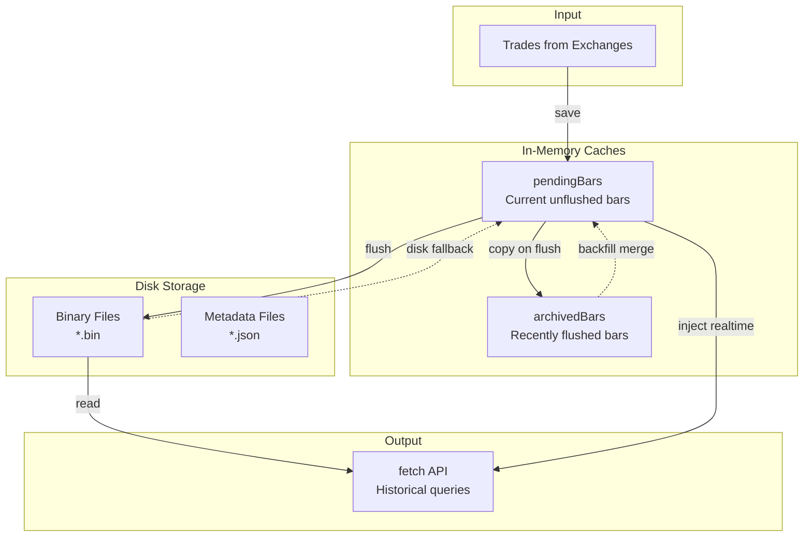
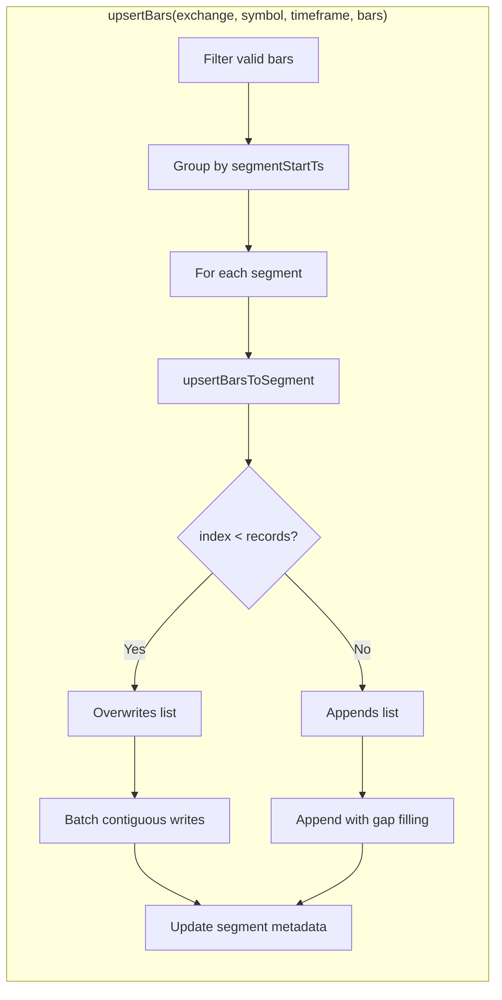
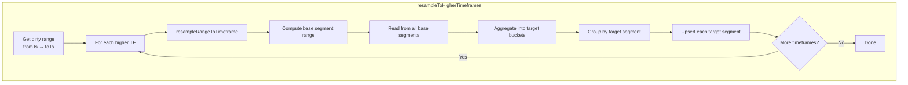
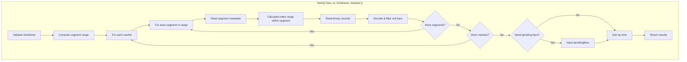

# Binaries Storage

A high-performance binary storage engine for OHLCV (Open, High, Low, Close, Volume) trade data. Designed as a drop-in replacement for InfluxDB storage with significant performance and simplicity benefits.

## Overview

Binaries Storage persists aggregated trade data in dense binary files with fixed-size records. Each market (e.g., `COINBASE:BTC-USD`) has separate **segmented files** for each timeframe, enabling bounded file growth and cold-storage archival.

### Key Features

- **Time-segmented files**: Data is split into fixed-size segments to prevent unbounded growth
- **Dense indexing**: Records are stored contiguously with null bars filling gaps
- **Upsert semantics**: Can overwrite existing records or append new ones
- **Automatic resampling**: Base timeframe data is aggregated to higher timeframes
- **Backfill support**: Late-arriving trades merge into existing buckets
- **Cold-storage ready**: Old segments can be moved/archived without rewriting files

## File Structure (Segmented)

```
data/
└── COINBASE/
    └── BTC-USD/
        ├── 10s/                    # Timeframe directory
        │   ├── 1704067200000.bin   # Segment file (segmentId = segmentStartTs)
        │   ├── 1704067200000.json  # Segment metadata
        │   ├── 1704108160000.bin   # Next segment
        │   ├── 1704108160000.json
        │   └── ...
        ├── 1m/
        │   ├── 1704067200000.bin
        │   ├── 1704067200000.json
        │   └── ...
        └── 1h/
            └── ...
```

### Segment ID Format

The segment ID is the **segment start timestamp in milliseconds** (as a string):
- Deterministic: `segmentStartTs = floor(barTs / segmentSpanMs) * segmentSpanMs`
- Reversible: `segmentStartTs = parseInt(segmentId)`
- File paths: `{exchange}/{symbol}/{timeframe}/{segmentId}.bin|json`

### Segment Size Calculation

Each timeframe has a fixed number of records per segment (default: 4096):

```javascript
segmentRecords = config.binariesSegmentRecords || 4096
segmentSpanMs = timeframeMs * segmentRecords

// Example for 10s timeframe:
// segmentSpanMs = 10000 * 4096 = 40,960,000 ms ≈ 11.4 hours
```

## Module Structure

```
src/storage/binaries/
├── index.js      # Main BinariesStorage class
├── constants.js  # Record size, scale factors, segment helpers
├── io.js         # File I/O operations, segment path helpers
├── resample.js   # Timeframe resampling logic (segment-aware)
└── write.js      # Upsert operations (segment-aware)
```

## Data Flow

### High-Level Architecture



### Trade Processing Flow

```mermaid
flowchart TD
    subgraph save["save(trades, isExiting)"]
        A[Receive trades] --> B[processTrades]
        B --> C{Flush interval?}
        C -->|Yes| D[flush]
        C -->|No| E[Return]
        D --> E
    end

    subgraph processTrades["processTrades(trades)"]
        P1[For each trade] --> P2[Floor timestamp to bucket]
        P2 --> P3{Bar exists in<br/>pendingBars?}
        P3 -->|Yes| P7[Use existing bar]
        P3 -->|No| P4{Bar exists in<br/>archivedBars?}
        P4 -->|Yes| P5[Restore to pendingBars]
        P4 -->|No| P6{Bar exists<br/>on disk?}
        P6 -->|Yes| P5
        P6 -->|No| P8[Create new bar]
        P5 --> P7
        P8 --> P7
        P7 --> P9[Merge trade into bar]
        P9 --> P10{More trades?}
        P10 -->|Yes| P1
        P10 -->|No| P11[Update price indexes]
    end

    subgraph flush["flush(isExiting)"]
        F1[For each market] --> F2[Collect closed bars]
        F2 --> F3[Sort by time]
        F3 --> F4[upsertBars to disk]
        F4 --> F5[Copy to archivedBars]
        F5 --> F6[cleanArchivedBars]
        F6 --> F7[resampleToHigherTimeframes]
        F7 --> F8{More markets?}
        F8 -->|Yes| F1
        F8 -->|No| F9[Done]
    end
```



### Upsert Operation (Segmented)



### Resampling Flow (Segmented)



### Fetch Query Flow (Segmented)



## Binary Record Format

Each record is exactly **56 bytes**:

| Offset | Size | Type       | Field | Description                         |
|--------|------|------------|-------|-------------------------------------|
| 0      | 4    | Int32LE    | open  | Open price × 10,000                 |
| 4      | 4    | Int32LE    | high  | High price × 10,000                 |
| 8      | 4    | Int32LE    | low   | Low price × 10,000                  |
| 12     | 4    | Int32LE    | close | Close price × 10,000                |
| 16     | 8    | BigInt64LE | vbuy  | Buy volume × 1,000,000              |
| 24     | 8    | BigInt64LE | vsell | Sell volume × 1,000,000             |
| 32     | 4    | UInt32LE   | cbuy  | Buy trade count                     |
| 36     | 4    | UInt32LE   | csell | Sell trade count                    |
| 40     | 8    | BigInt64LE | lbuy  | Buy liquidation volume × 1,000,000  |
| 48     | 8    | BigInt64LE | lsell | Sell liquidation volume × 1,000,000 |

### Scale Factors

- **PRICE_SCALE = 10,000**: Prices stored with 4 decimal places precision
- **VOLUME_SCALE = 1,000,000**: Volumes stored with 6 decimal places precision

### Null Bars

Gaps in data are represented as "null bars" where all OHLC values are 0. These maintain dense indexing (record position = time offset) but are skipped when reading.

## Segment Metadata Format

Each segment's `.json` file contains:

```json
{
  "exchange": "COINBASE",
  "symbol": "BTC-USD",
  "timeframe": "10s",
  "timeframeMs": 10000,
  "segmentStartTs": 1704067200000,
  "segmentEndTs": 1704108160000,
  "segmentSpanMs": 40960000,
  "segmentRecords": 4096,
  "priceScale": 10000,
  "volumeScale": 1000000,
  "records": 2048,
  "lastInputStartTs": 1704087680000
}
```

### Segment Metadata Fields

| Field            | Description                                                 |
|------------------|-------------------------------------------------------------|
| `segmentStartTs` | First bucket timestamp in this segment                      |
| `segmentEndTs`   | `segmentStartTs + segmentSpanMs` (exclusive end)            |
| `segmentSpanMs`  | Total time span of segment in milliseconds                  |
| `segmentRecords` | Fixed max records for this segment (default 4096)           |
| `records`        | Current number of records written (may be < segmentRecords) |

## Memory Caches

### pendingBars

In-memory buffer of bars not yet written to disk. Structure:

```javascript
{
  "COINBASE:BTC-USD": {
    1704067200000: { time, open, high, low, close, vbuy, vsell, cbuy, csell, lbuy, lsell },
    1704067210000: { ... }
  }
}
```

### archivedBars

Cache of recently flushed bars (last ~100 buckets). Enables backfill merging when late trades arrive for already-persisted buckets.

## Merge Semantics

When multiple trades arrive for the same bucket:

| Field | Rule | Description |
|-------|------|-------------|
| open | **Sticky** | Once set, never changes (first trade wins) |
| high | Max | Maximum of all trade prices |
| low | Min | Minimum of all trade prices |
| close | **Last write wins** | Updates with each trade |
| volumes | Sum | Cumulative sum |
| counts | Sum | Cumulative sum |

## Backfill Support

Handles reconnection scenarios where older trades arrive after newer ones:

1. **pendingBars lookup**: Check if bucket exists in memory
2. **archivedBars lookup**: Check recently-flushed cache
3. **Disk fallback**: Read single record from binary file
4. **Create new**: Initialize empty bar if bucket doesn't exist

This ensures trades are never lost, even during exchange reconnections.

## Configuration

Relevant config options (from `config.json`):

```javascript
{
  "storage": "binaries",           // Enable binaries storage
  "filesLocation": "./data",       // Data directory
  "influxTimeframe": 10000,        // Base timeframe (10s)
  "influxResampleTo": [            // Higher timeframes to generate
    15000, 30000, 60000,           // 15s, 30s, 1m
    180000, 300000, 900000,        // 3m, 5m, 15m
    1800000, 3600000, 7200000,     // 30m, 1h, 2h
    14400000, 21600000, 86400000   // 4h, 6h, 1d
  ],
  "influxResampleInterval": 60000, // Flush/resample interval (1m)
  "backupInterval": 60000,         // Backup interval (1m)
  
  // Segment configuration (optional)
  "binariesSegmentRecords": 4096   // Records per segment (default)
  
  // Or per-timeframe configuration:
  // "binariesSegmentRecords": {
  //   "10s": 8640,    // ~24 hours of 10s bars
  //   "1m": 4320,     // ~3 days of 1m bars
  //   "1h": 4320,     // ~180 days of 1h bars
  //   "1d": 3650      // ~10 years of daily bars
  // }
}
```

### Segment Size Examples

| Timeframe | Default Records | Default Span |
|-----------|-----------------|--------------|
| 10s       | 4096            | ~11.4 hours  |
| 1m        | 4096            | ~2.8 days    |
| 1h        | 4096            | ~170 days    |
| 1d        | 4096            | ~11.2 years  |

## API Compatibility

The `fetch()` method returns data in the same format as InfluxDB storage:

```javascript
{
  format: "point",
  columns: { time: 0, market: 1, open: 2, high: 3, low: 4, close: 5, vbuy: 6, vsell: 7, cbuy: 8, csell: 9, lbuy: 10, lsell: 11 },
  results: [
    [1704067200, "COINBASE:BTC-USD", 42000.5, 42100.0, 41900.0, 42050.0, 1234.56, 987.65, 150, 120, 0, 0],
    // ... more rows
  ]
}
```

**Note**: Time is returned in **seconds** (not milliseconds) to match InfluxDB's `precision: 's'` setting.

## Performance Optimizations

### In-Memory Caches

The storage engine uses two LRU caches to reduce syscall overhead on hot paths:

#### Metadata Cache

Caches parsed JSON metadata files with mtime-based validation:

```javascript
{
  "binariesMetaCacheMax": 5000  // Max cached metadata entries (default)
}
```

- **Key**: Absolute path to `.json` file
- **Value**: `{ meta, mtime }` tuple
- **Invalidation**: Re-read if file mtime changes or on explicit invalidation
- **Eviction**: LRU when cache exceeds `binariesMetaCacheMax`

#### File Descriptor Cache

Caches open file descriptors for read-mode access:

```javascript
{
  "binariesFdCacheMax": 256  // Max cached file descriptors (default)
}
```

- **Key**: Absolute path to `.bin` file
- **Value**: `{ fd, mode }` tuple
- **Eviction**: LRU with `fs.closeSync()` on eviction
- **Cleanup**: Call `closeAllFds()` on graceful shutdown

### Fast Null-Bar Check

Uses `isNullRecord(buffer, offset)` which only reads the first 16 bytes (OHLC int32s) to detect null bars without full decode.

### Positioned Reads

Uses `fs.readSync()` with offset parameter (pread) for single-record lookups, avoiding file seek state.

## Performance Characteristics

| Operation | Complexity | Notes |
|-----------|------------|-------|
| Write (append) | O(n) | Sequential append, batched per segment |
| Write (overwrite) | O(n) | Positioned writes, batched by contiguous indices |
| Read (fetch) | O(n + s) | n=records, s=segments in range |
| Resample | O(n) | Reads base segments, writes target segments |

### Syscall Reduction

| Operation | Before | After (with caches) |
|-----------|--------|---------------------|
| Metadata read | `readFileSync` + `JSON.parse` | Cached lookup + mtime check |
| File open | `openSync` per read | Cached FD reuse |
| File stat | `fstatSync` per read | Uses `meta.records` from cache |
| File close | `closeSync` per read | Deferred until eviction |

### Advantages over InfluxDB

- **No external service**: Runs in-process, no network overhead
- **Simpler deployment**: Just files on disk
- **Faster writes**: Direct file I/O vs HTTP API
- **Predictable performance**: No query planning overhead
- **Lower memory**: Stream processing vs in-memory aggregation
- **Bounded growth**: Segments prevent unbounded file sizes

### Advantages of Segmentation

- **Cold storage**: Old segments can be moved to cold storage without rewriting
- **Parallel reads**: Multiple segments can theoretically be read in parallel
- **Bounded file size**: Each segment has a maximum size of `segmentRecords * 56` bytes
- **Easy cleanup**: Delete old segments without affecting current data

## Cross-Segment Queries

When fetching data that spans multiple segments:

1. **Segment range computation**: Calculate which segment IDs intersect `[from, to)`
   ```javascript
   firstSegmentStartTs = floor(from / segmentSpanMs) * segmentSpanMs
   lastSegmentStartTs = floor((to - 1) / segmentSpanMs) * segmentSpanMs
   ```

2. **Index calculation**: For each segment, compute local indices
   ```javascript
   localIndex = floor((barTs - segmentStartTs) / timeframeMs)
   ```

3. **Efficient reads**: Only read the required byte ranges from each segment

4. **Missing segments**: If a segment file doesn't exist, that time range is simply empty

## Backfill with Segments

Backfill support works with segments:

1. **Segment lookup**: Compute which segment the bucket belongs to
2. **Single-record read**: Read only the 56-byte record at the correct offset
3. **Merge in memory**: Combine disk data with incoming trade
4. **Write back**: Upsert the merged bar to the correct segment
